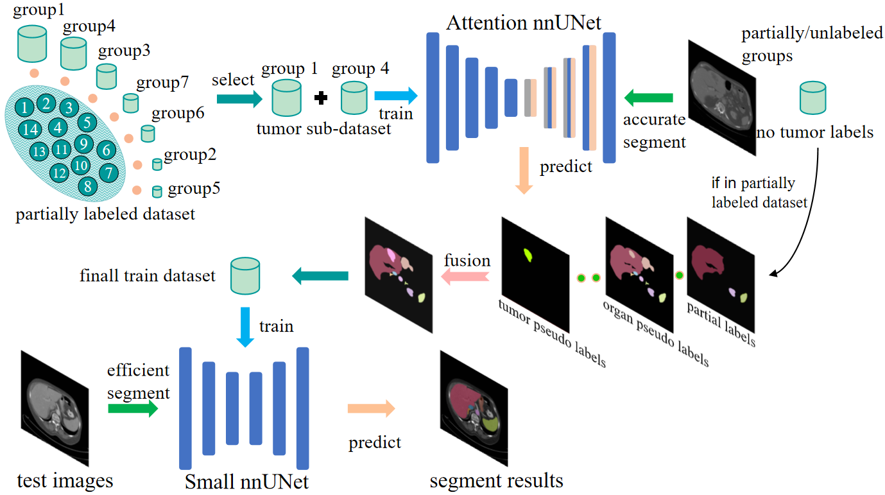

# Solution of Team zzm3zz for FLARE2023 Challenge
**A Semi-Supervised Abdominal Multi-Organ Pan-Cancer Segmentation Framework with Knowledge Distillation and Multi-Label Fusion** \
*Zengmin Zhang Xiaomeng Duan Yanjun Peng Zhengyu Li* \



Built upon [MIC-DKFZ/nnUNet](https://github.com/MIC-DKFZ/nnUNet), this repository provides the solution of team zzm3zz for [MICCAI FLARE23](https://codalab.lisn.upsaclay.fr/competitions/12239#learn_the_details-overview) Challenge. The details of our method are described in our [paper](https://openreview.net/forum?id=PLFBzKnjOt). 

You can reproduce our method as follows step by step:

## Environments and Requirements

- Ubuntu 20.04.3 LTS
- CPU AMD EPYC 7T83@3.50GHz
- RAM 1×90GB; 320MT/s
- GPU 1 NVIDIA RTX 4090 24G
- CUDA version 11.3
- python version 3.8.10

To install requirements:

```setup
pip install -r requirements.txt
```

## Dataset

- data [link](https://codalab.lisn.upsaclay.fr/competitions/12239#learn_the_details-dataset).(you need join this challenge.)

## Preprocessing

A brief description of the preprocessing method

- cropping:
Follow the default method of nnU-Net
- intensity normalization:
Follow the default method of nnU-Net
- resampling:
Attention nnU-Net: [0.8164, 0.8164]
Small nnU-Net: [4, 1.2, 1.2]  

After selecting data from 1497 cases with tumor labels, Changing non 14 to background, 14 to 1.
Running the data preprocessing code for teacher model attention nnU-Net to generate tumor pseudo-label:

```python
nnUNet_plan_and_preprocess -t 9 -pl2d ExperimentPlanner2D_Attention -pl3d None
```

## Training

### 1 Train Teacher Model Attention nnU-Net for tumor pseudo-label

#### 1.1 Training Teacher Model Attention nnUNet by all fold 
```
nnUNet_train 2d nnUNetTrainerV2_Attention 9 all -p nnUNetPlansAttention
```

#### 1.2 Generate Pseudo Labels for missing tumor annotations Data
```
nnUNet_predict -i INPUTS_FOLDER -o OUTPUTS_FOLDER  -t 9  -tr nnUNetTrainerV2_Attention  -m 2d  -p nnUNetPlansAttention  --disable_tta 
```

### 2. Mutil-Label_Fusion
We use organ pseudo labels provided by [Flare22 winner](https://codalab.lisn.upsaclay.fr/competitions/12239#learn_the_details-dataset) team with the highest accuracy.
#### 2.1 Fuse partial labels and tumor pseudo-labels
We first use tumor pseudo-label generated by the Teacher model to fuse with partial labels.
For those lacking tumor annotations in 2200 partially labeled datasets and 1800 unlabeled datasets.
```
run part_tumor_organ_fuse.py
```

#### 2.2 Fuse organs pseudo-labels
After fusing tumor pseudo-labels, we then fuse the organ label to the above mixed labels for all 4000 cases which may lack organ annotations.
```
run tumor_organs_fuse.py
```


### 3. Train Student Model Small nnU-Net 
After obtaining all 4000 cases of mix-labels, we train the student model to do the final work.
#### 3.1. Conduct automatic preprocessing using nnU-Net
Here we use the plan designed for small nnUNet.
```
nnUNet_plan_and_preprocess -t 6 -pl3d ExperimentPlanner3D_FLARE22Small -pl2d None
```
#### 3.2. Train small nnUNet on all training data
```
nnUNet_train 3d_fullres nnUNetTrainerV2_FLARE_Small 6 all -p nnUNetPlansFLARE22Small
```

## Inference

### 1. To infer the testing cases, run this command:

```python
nnUNet_predict -i INPUT_FOLDER  -o OUTPUT_FOLDER  -t 6  -p nnUNetPlansFLARE22Small   -m 3d_fullres \
 -tr nnUNetTrainerV2_FLARE_Small  -f all  --mode fastest --disable_tta
```

### 2. [Colab](https://colab.research.google.com/) jupyter notebook

### 3. Docker containers on [DockerHub](https://hub.docker.com/r/zhangzengmin/zzm3zz/tags)

```bash
docker container run --gpus "device=0" -m 28G --name algorithm --rm -v $PWD/CellSeg_Test/:/workspace/inputs/ -v $PWD/algorithm_results/:/workspace/outputs/ algorithm:latest /bin/bash -c "sh predict.sh"
```

## Evaluation

To compute the evaluation metrics, run:

```eval
python Dice_NSD.py
```

## Results

Our method achieves the following performance on [FLARE23: Fast, Low-resource, and Accurate oRgan and Pan-cancer sEgmentation in Abdomen CT](https://codalab.lisn.upsaclay.fr/competitions/12239#learn_the_details-overview)
| Model name       | Organs DICE | Tumor DICE |  All DICE  | All NSD |
| ---------------- | :---------: | :--------: | :--------: | :-----: |
| My awesome model |   88.53%    |   30.47%   |   84.38%   |  89.28% |


## Acknowledgement

> We thank the contributors of public datasets. 


## Citation
If you use this code for your research, please cite our paper:

```
@incollection{zhang2023semi,
  title={A Semi-supervised Abdominal Multi-organ Pan-Cancer Segmentation Framework with Knowledge Distillation and Multi-label Fusion},
  author={Zhang, Zengmin and Duan, Xiaomeng and Peng, Yanjun and Li, Zhengyu},
  booktitle={MICCAI Challenge on Fast and Low-Resource Semi-supervised Abdominal Organ Segmentation},
  pages={346--361},
  year={2023},
  publisher={Springer}
}
```


